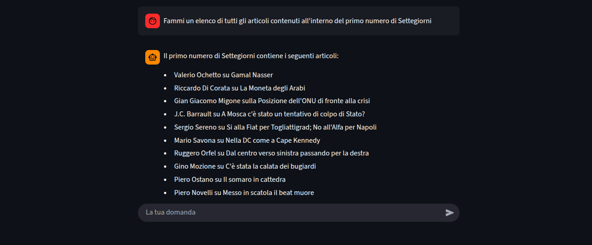

# Streamlit LlamaIndex RAG with Citations

This project is a web application built with Streamlit that implements a Retrieval-Augmented Generation (RAG) pipeline using LlamaIndex. It allows users to ask questions about a collection of documents and receive answers with citations, pointing to the specific sources of information within the documents.

The application uses ChromaDB as a vector store to efficiently retrieve relevant context from the documents in the `data` directory.

This a screenshot of an ongoing conversation:



## Features

- Interactive chat interface powered by Streamlit.
- Query documents using natural language.
- Receive answers generated by a Large Language Model (LLM).
- Answers include citations to the source documents for verification.
- Uses LlamaIndex for the RAG pipeline.
- Uses ChromaDB for vector storage.

## Tech Stack

- [Streamlit](https://streamlit.io/)
- [OpenAI](https://openai.com/)
- [LlamaIndex](https://www.llamaindex.ai/)
- [NLTK](https://www.nltk.org/)
- [ChromaDB](https://www.trychroma.com/)

## Setup and Installation

1.  **Clone the repository:**
    ```bash
    git clone <repository-url>
    cd streamlit-llamaindex-rag-citation
    ```

2.  **Create and activate a Python virtual environment:**
    ```bash
    python -m venv citationenv
    source citationenv/bin/activate
    # On Windows, use:
    # citationenv\Scripts\activate
    ```

3.  **Install the required dependencies:**
    ```bash
    pip install -r requirements.txt
    ```

4.  **Set up your API keys:**
    Create a file named `secrets.toml` inside a `.streamlit` directory.

    ```
    .streamlit/
    └── secrets.toml
    ```

5.  **Add your OpenAI API key to `secrets.toml`:**
    ```toml
    OPENAI_API_KEY = "sk-..."
    ```

## Usage

1.  **Add your data:**
    Place the PDF documents you want to query in the `data` directory. The project comes with some example documents.

2.  **Run the Streamlit application:**
    ```bash
    streamlit run citation_app.py
    ```

3.  **Open your browser:**
    Navigate to the local URL provided by Streamlit (usually `http://localhost:8501`).

## Project Structure

```
.
├── .gitignore
├── citation_app.py         # Main Streamlit application
├── readme.md               # This file
├── requirements.txt        # Python dependencies
├── .streamlit/
│   └── secrets.toml        # Secrets management for Streamlit
├── chroma_db/              # ChromaDB vector store
├── citation/               # LlamaIndex storage
├── citationenv/            # Python virtual environment
└── data/                   # Source documents (PDFs)
```
